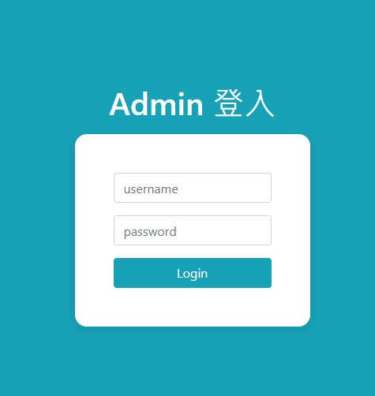
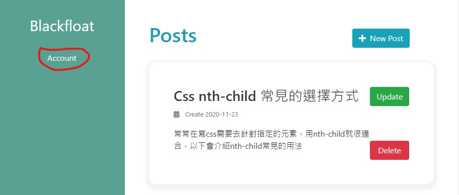
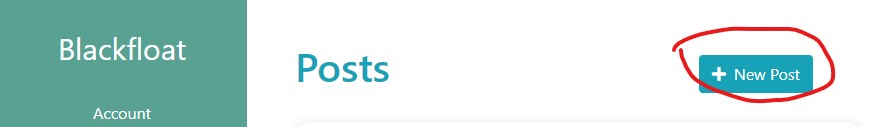
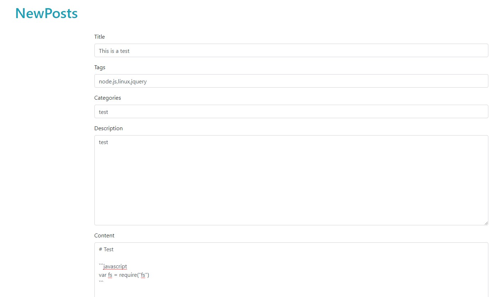

# BLOG


[demo](http://35.236.180.209/)

## 介紹
* 這是我用來放自己筆記的blog，樣板主要都是看各大別人寫的blog拼湊出來
* 使用koa-generator生成mvc架構
* 資料庫已mongodb為主
* 以scss為主，雖然沒用到什麼function與variable

## Get start
* 資料庫使用mongodb所以須先安裝
    * [安裝流程](http://35.236.180.209/content/5fe5d53a4d8a12084f2a944e)
```shell
$ npm install
$ npm start 
```

## 後台

* 目前還沒寫RWD
* 進到127.0.0.1/admin<br>

* username:admin,password:password即可登入
* 建議一開始進入先去更改密碼
* 點擊account即可更改密碼，需先輸入原先密碼password

* 回到主頁點擊newpost開始po文<br>

* NewPosts
    * Title為標題
    * Tags為標籤每個標籤以","為分別
    * Description用來描述下面的content
    * Content 裡面可用markdown的結構或是html來寫

